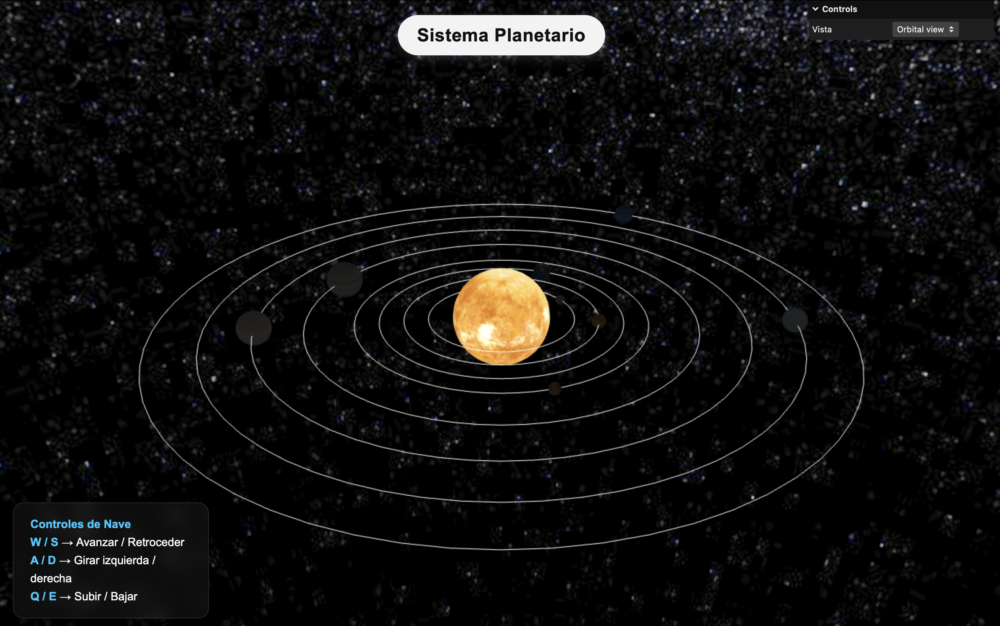
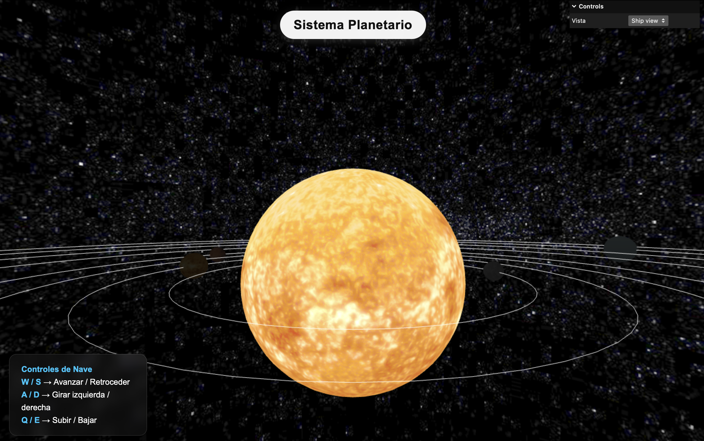

<!-- @import "design/style.css" -->
Autore: Francesco Faustino Greco  

# **SIMULACIÓN DEL SISTEMA SOLAR - THREE.JS**

## Índice

- [Introducción](#introducción)
- [Estructura del Proyecto](#estructura-del-proyecto)
- [Planetas y Órbitas](#planetas-y-órbitas)
- [Vista Nave](#vista-nave)
- [Animación](#animación)
- [Fuentes y Documentación](#fuentes-y-documentación)

---

## Introducción

El objetivo de este proyecto es **simular visualmente el sistema solar** usando **Three.js**, mostrando los planetas orbitando alrededor del Sol.  

El proyecto combina conceptos de **gráficos 3D en tiempo real**, texturización de objetos, iluminación y manipulación de cámara para ofrecer una experiencia interactiva del sistema solar.

<p align="center">
  
</p>

---

## Estructura del Proyecto

El proyecto está organizado en un solo script JavaScript que incluye:

1. Inicialización de la escena (`scene`) y del renderer (`WebGLRenderer`).
2. Configuración de la cámara (`PerspectiveCamera`) y controles (`OrbitControls`).
3. Creación del Sol y los planetas mediante **meshes esféricos**.
4. Representación de **órbitas planetarias** con líneas circulares.
5. Animación continua de los planetas y rotación del Sol.
6. Integración de un **fondo espacial** mediante una textura de galaxia.
7. Interacción mediante la GUI `lil-gui` para visualizar información del sistema.

Se importan las librerías principales:

```javascript
import * as THREE from 'three';
import { OrbitControls } from 'three/examples/jsm/controls/OrbitControls';
import { GUI } from 'three/examples/jsm/libs/lil-gui.module.min.js';
```

## Planetas y Órbitas
Cada planeta se crea usando la función createPlanetWithOrbit:
Parámetros: nombre, textura, tamaño, radio de órbita, velocidad y opcionalmente textura extra para nubes o anillos.
Se calcula un ángulo inicial aleatorio para cada planeta.
Se dibuja la órbita con LineLoop.
Se añade a un arreglo planets para animación.

```javascript
function createPlanetWithOrbit(name, texturePath, size, radius, speed, extraTexture = null, extraOpacity = 0) {
    const tex = new THREE.TextureLoader().load(texturePath);
    const planet = new THREE.Mesh(
        new THREE.SphereGeometry(size, 32, 32),
        new THREE.MeshPhongMaterial({ map: tex })
    );
    const angle = Math.random() * Math.PI * 2;
    planet.position.set(radius * Math.cos(angle), 0, radius * Math.sin(angle));
    planet.userData = { radius, speed, angle };
    scene.add(planet);
    planets.push(planet);

    // Orbita
    const points = [];
    const segments = 64;
    for (let i = 0; i <= segments; i++) {
        const theta = (i / segments) * Math.PI * 2;
        points.push(new THREE.Vector3(radius * Math.cos(theta), 0, radius * Math.sin(theta)));
    }
    const orbit = new THREE.LineLoop(
        new THREE.BufferGeometry().setFromPoints(points),
        new THREE.LineBasicMaterial({ color: 0xffffff })
    );
    scene.add(orbit);

    // Capa extra (nubes o anillos)
    if (extraTexture) {
        const extraTex = new THREE.TextureLoader().load(extraTexture);
        const extraMesh = new THREE.Mesh(
            new THREE.SphereGeometry(size + 0.1, 32, 32),
            new THREE.MeshPhongMaterial({ map: extraTex, transparent: true, opacity: extraOpacity, side: THREE.DoubleSide })
        );
        planet.add(extraMesh);
    }
}
```
---
## Vista Nave
Además de la vista orbital con OrbitControls, se ha implementado un modo Nave que permite moverse libremente por el espacio, como si el usuario pilotara una nave espacial.

### Caracteristicas
- Movimiento libre con las teclas
- Transición suave entre modos cámara / nave
La cámara no está anclada a ningún planeta, lo que permite explorar el sistema solar desde cualquier punto de vista.

```javascript
const moveSpeed = 0.5;
const rotationSpeed = 0.02;
const keys = {};

window.addEventListener('keydown', e => keys[e.key.toLowerCase()] = true);
window.addEventListener('keyup', e => keys[e.key.toLowerCase()] = false);

function updateSpaceshipControls() {
    if (keys['w']) camera.position.add(camera.getWorldDirection(new THREE.Vector3()).multiplyScalar(moveSpeed));
    if (keys['s']) camera.position.add(camera.getWorldDirection(new THREE.Vector3()).multiplyScalar(-moveSpeed));
    if (keys['a']) camera.position.x -= moveSpeed;
    if (keys['d']) camera.position.x += moveSpeed;
    if (keys['q']) camera.position.y += moveSpeed;
    if (keys['e']) camera.position.y -= moveSpeed;

    if (keys['arrowleft']) camera.rotation.y += rotationSpeed;
    if (keys['arrowright']) camera.rotation.y -= rotationSpeed;
    if (keys['arrowup']) camera.rotation.x += rotationSpeed;
    if (keys['arrowdown']) camera.rotation.x -= rotationSpeed;
}

```

Y dentro del ciclo de animación principal:

```javascript
function animate() {
    requestAnimationFrame(animate);
    animatePlanets();
    updateSpaceshipControls();
    sun.rotation.y += 0.005;
    renderer.render(scene, camera);
}
```

### Interfaz Visual (HTML)
En el HTML se ha añadido una pequeña leyenda de controles fija en pantalla:
```html
    <div class="controls">
        <strong>Controles de Nave</strong><br>
        <strong>W / S</strong> → Avanzar / Retroceder<br>
        <strong>A / D</strong> → Girar izquierda / derecha<br>
        <strong>Q / E</strong> → Subir / Bajar<br>
        <strong>⬆️⬇️⬅️➡️ -> Rotar Cámara<br>
    </div>
```

<p align="center">
  
</p>

---

## Animación

Los planetas se animan en órbitas circulares y rotación axial:

```javascript
function animatePlanets() {
    planets.forEach(p => {
        p.userData.angle += p.userData.speed;
        p.position.set(
            p.userData.radius * Math.cos(p.userData.angle),
            0,
            p.userData.radius * Math.sin(p.userData.angle)
        );
        p.rotation.y += 0.01;
    });
}
```

El sol tambien rota lentamente:

```javascript
sun.rotation.y += 0.005;
```

La animación principal se ejecuta mediante requestAnimationFrame:
```javascript
function animate() {
    requestAnimationFrame(animate);
    animatePlanets();
    sun.rotation.y += 0.005;
    controls.update();
    renderer.render(scene, camera);
}
```

---

## Fuentes y Documentación
- Three.js Documentation
- OrbitControls
- [Solar Textures](https://www.solarsystemscope.com/textures/)
- lil-gui – Librería de interfaz gráfica para control de parámetros
- ChatGPT para ayuda lingüística
